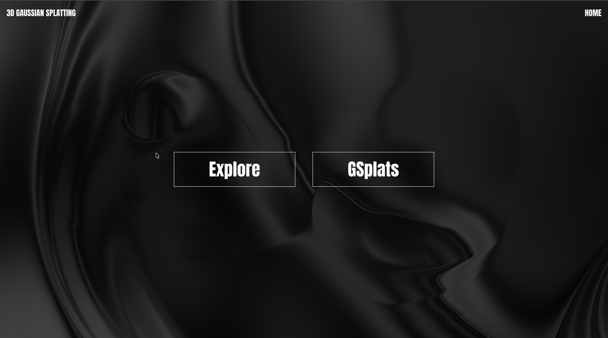

# 3D Gaussian Splatting – Interactive Web Experience



A stunning, high-performance web showcase of **3D Gaussian Splatting (3DGS)** built with **gsplat.js**, **Three.js**, **GSAP**, and **Lenis**. This project demonstrates real-time photorealistic 3D scene rendering directly in the browser — no meshes, no NeRF waiting times — just millions of glowing 3D Gaussians rendered at 120+ FPS.

Live Demo: [https://3dgs3js.vercel.app/](https://3dgs3js.vercel.app/)

### Features

- Real-time **3D Gaussian Splatting** viewer using [`gsplat.js`](https://github.com/huggingface/gsplat.js)
- Multiple preloaded `.splat` scenes (people, statues, campus)
- Smooth orbit & FPS controls
- Interactive fluid gradient background (mouse-reactive shader)
- Scroll-triggered 3D animations (hand model orbiting camera visualization)
- Particle-based hand disintegration effect
- Elliptical glowing orb with custom shaders
- Responsive design with smooth scrolling via **Lenis + GSAP ScrollTrigger**
- Preloads all assets with progress bar

### Preview Gallery

| Scene | Name |
|-------------------------------------------------------------|----------------------------|
|                              | **Splat 1: Kotwani Sir**
|                          | **Splat 2: Nitesh Sir**
|                      | **Splat 3: Shubhi Ma'am**
|                         | **Splat 4: Kamesh Sir**
|                                | **Splat 5: Ancient Statue**
|                             | **Splat 6: LCIT Campus (Large Scene)**

> All Gaussian splats trained from short 360° videos using tools like Luma AI / Polycam.

### Tech Stack

| Technology           | Purpose                              |
|----------------------|---------------------------------------|
| `gsplat.js`          | Core 3D Gaussian Splatting renderer   |
| `three.js`           | 3D scene management, models, shaders  |
| `vite`               | Fast dev server & build tool          |
| `gsap + ScrollTrigger` | Smooth scroll animations             |
| `lenis`              | Buttery smooth scrolling              |
| `WebGL Shaders`      | Fluid background, glowing ellipse, particles |
| `GLTF + Draco`       | Compressed 3D model loading           |


### How to Run Locally

```bash
git clone https://github.com/HarshitKumarSahu/3dgs3js
cd 3dgs3js
npm install
npm run dev
```

Open http://localhost:5173

To build for production:
```bash 
npm run build
```

### Credits & Tools Used

- Original Research: 3D Gaussian Splatting for Real-Time Radiance Field Rendering
- gsplat.js by Hugging Face: https://github.com/huggingface/gsplat.js
- Training tools: Brush
- Inspiration: @tvnisxq, @HarshitKumarSahu 

### Future Ideas (4DGS Coming Soon)

- Add 4D Gaussian Splatting (dynamic/animated scenes)
- Mobile optimization
- Upload your own .splat file
- AR mode using WebXR

---
Made with passion for the future of real-time 3D on the web
By Harshit Kumar Sahu & Tanishq Sharma
---
